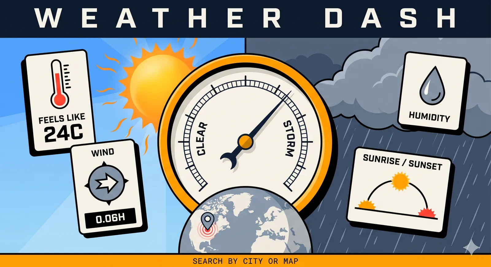

# Weather Dashboard



A weather dashboard built with **Next.js**. Search for a city or click anywhere on the map to see its current weather. Data comes from the [OpenWeather API](https://openweathermap.org/api) through the app's own serverless API routes, so the API key never reaches the browser.

## Features

- Search by city name, with suggestions as you type (arrow keys, Enter, Escape)
- Click anywhere on the map for that point's weather, including open water
- Temperature, feels-like, min/max, humidity, pressure, wind speed and direction, visibility, cloud cover
- Local time and a sunrise/sunset arc, correct whatever your own timezone
- Animated backgrounds per condition, switching to night when the sun sets at that location
- Serverless: deploys to Vercel (or any Node.js host) with no other services

## Project structure

```
frontend/
├── components/
│   ├── scenes/            # Animated background scenes (sun, rain, snow, …) and SceneFX selector
│   ├── WeatherDisplay.tsx # Current-conditions panel
│   ├── WeatherForm.tsx    # Search box with suggestions
│   ├── WeatherMap.tsx     # Leaflet map
│   ├── Header.tsx, Footer.tsx, PageHead.tsx, ErrorBoundary.tsx
├── hooks/
│   ├── useWeather.ts      # Loads weather: cancels stale requests, caches results
│   └── useNow.ts          # Shared once-a-minute clock
├── lib/
│   ├── openweather.ts     # Server-only: validation, rate limit, upstream calls
│   ├── owSchemas.ts       # Server-only: zod schemas for OpenWeather responses
│   ├── forecast.ts        # Server-only: 3-hour forecast → hourly strip + daily summaries
│   ├── types.ts           # Response types of our /api routes (shared with the browser)
│   ├── weatherClient.ts   # Browser-side calls to /api, error messages, cache
│   ├── time.ts            # Timezone-safe time and sun maths
│   └── scene.ts           # Condition → background scene
├── pages/
│   ├── index.tsx          # Dashboard
│   ├── 404.tsx
│   └── api/
│       ├── weather.ts         # GET /api/weather?city= | ?lat=&lon=
│       ├── forecast.ts        # GET /api/forecast?lat=&lon=  (next 24 h + daily)
│       ├── air.ts             # GET /api/air?lat=&lon=       (air quality index)
│       └── geocode/
│           ├── index.ts       # GET /api/geocode?q=        (search suggestions)
│           └── reverse.ts     # GET /api/geocode/reverse?lat=&lon=  (map-click names)
├── styles/                # Global CSS
├── test/                  # API tests and helpers
└── .env.example           # Environment variables template
```

## Setup

Requires Node.js 22 (see `frontend/.nvmrc`).

```bash
cd frontend
npm install
cp .env.example .env.local   # then put your OpenWeather key in .env.local
npm run dev
```

Open <http://localhost:3000>. Get a free API key at <https://openweathermap.org/api>.

| Variable | Required | Purpose |
|---|---|---|
| `OPENWEATHER_API_KEY` | Yes | Used only by the `/api` routes, never sent to the browser. Don't create a `NEXT_PUBLIC_` copy. |
| `SITE_URL` | No | Absolute URL for social-preview links. Defaults to the Vercel production domain, or `http://localhost:3000`. |

## Development

Run these from `frontend/`:

| Command | What it does |
|---|---|
| `npm run lint` | ESLint (Next.js core-web-vitals rules) |
| `npm run format` | Format with Prettier (`format:check` only reports) |
| `npm test` | Run the Vitest suite once (`test:watch` to re-run on save) |
| `npm run build` | Production build |

CI (`.github/workflows/ci.yml`) runs lint, format check, tests, build and `npm audit --omit=dev` on every pull request and push to `main`.

## Deployment (Vercel)

1. Import the repository in Vercel and set the **Root Directory** to `frontend`.
2. Add `OPENWEATHER_API_KEY` under Project → Settings → Environment Variables.
3. Deploy. Every pull request gets its own preview URL.

## How it works

```
Browser
  ├─ GET /api/weather?city=London          ─┐
  ├─ GET /api/forecast?lat=&lon=            │
  ├─ GET /api/air?lat=&lon=                 ├─ Next.js API routes (validate input, rate-limit,
  ├─ GET /api/geocode?q=Lon                 │   add the API key, cache for 5 min)
  └─ GET /api/geocode/reverse?lat=&lon=    ─┘
                                                   └─ api.openweathermap.org
```

## License

[MIT](LICENSE) © 2026 AHILL
